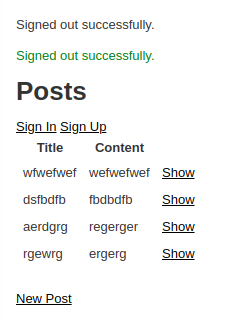

# Members Only Club

> Create posts about non-members and only reveal the post author to members of the club!

Post author only appears when the user is signed in. Users can create as many posts as they like.

## Built With

- Rails
- Ruby,
- Devise Gem

## Authors

👤 **Azeem Ahmed**

- Github: [@Azeem838](https://github.com/Azeem838)

👤 Rajkumar Das

- Github: [@rajkumardas2701](https://github.com/rajkumardas2701)
- Twitter: [@Rajkuma58621299](https://twitter.com/Rajkuma58621299)
- Linkedin: [Rajkumar Das](https://www.linkedin.com/in/rajkumar-das-41308961/)

## 🤝 Contributing

Contributions, issues and feature requests are welcome!

Feel free to check the [issues page](https://github.com/rajkumardas2701/members-only/issues).

## Show your support

Give a ⭐️ if you like this project!

## 📝 License

This project is [MIT](lic.url) licensed.
